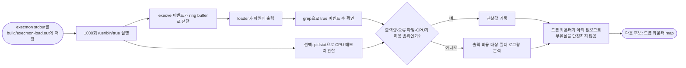

# 2026-10-29 — 제한된 부하 관찰

목표: 제한된 반복 실행에서 출력량과 CPU 사용량을 기록하고, 현재 드롭 측정의 한계를 확인한다.

```mermaid
flowchart LR
    start([execmon stdout를<br/>build/execmon-load.out에 저장]) --> load[1000회 /usr/bin/true 실행]
    load --> events[execve 이벤트가 ring buffer로 전달]
    events --> output[loader가 파일에 출력]
    output --> count[grep으로 true 이벤트 수 확인]
    load --> metrics[선택: pidstat으로 CPU·메모리 관찰]
    count --> assess{출력량·오류 파일·CPU가<br/>허용 범위인가?}
    metrics --> assess
    assess -- 예 --> fact[관찰값 기록]
    assess -- 아니오 --> review[출력 비용·대상 필터·로그량 분석]
    fact --> limit[드롭 카운터가 아직 없으므로<br/>무유실을 단정하지 않음]
    review --> limit
    limit --> next([다음 후보: 드롭 카운터 map])
```

## 해석 원칙

현재 코드에는 `bpf_ringbuf_reserve()` 실패 횟수를 세는 map이 없다. 따라서 1,000회 테스트에서 보이는 출력은 관찰값이지, 유실이 없다는 보증은 아니다.

