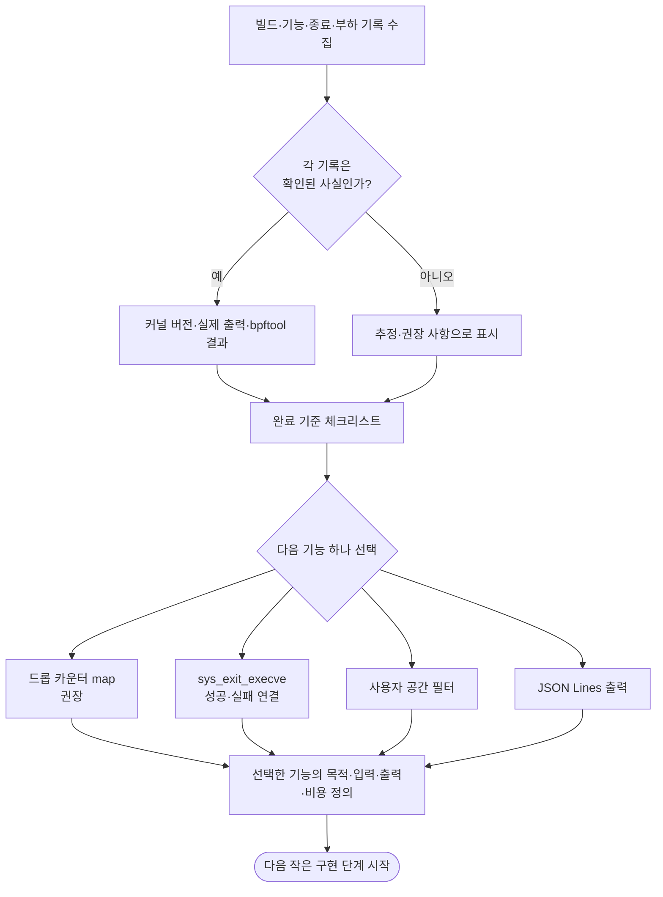

# 2026-10-30 — 회고와 다음 기능 결정

목표: 검증 결과를 사실과 추정으로 나누고, 다음 구현 범위를 한 기능으로 제한한다.

```mermaid
flowchart TD
    collect[빌드·기능·종료·부하 기록 수집] --> classify{각 기록은<br/>확인된 사실인가?}
    classify -- 예 --> facts[커널 버전·실제 출력·bpftool 결과]
    classify -- 아니오 --> assumptions[추정·권장 사항으로 표시]
    facts --> checklist[완료 기준 체크리스트]
    assumptions --> checklist
    checklist --> choose{다음 기능 하나 선택}
    choose --> drop[드롭 카운터 map<br/>권장]
    choose --> exit[sys_exit_execve<br/>성공·실패 연결]
    choose --> filter[사용자 공간 필터]
    choose --> json[JSON Lines 출력]
    drop --> scope[선택한 기능의 목적·입력·출력·비용 정의]
    exit --> scope
    filter --> scope
    json --> scope
    scope --> next([다음 작은 구현 단계 시작])
```

## 현재 추천

다음 기능은 **드롭 카운터 map**이다. 부하 관찰에서 이벤트 유실을 수치로 확인할 기반이 되기 때문이다.

